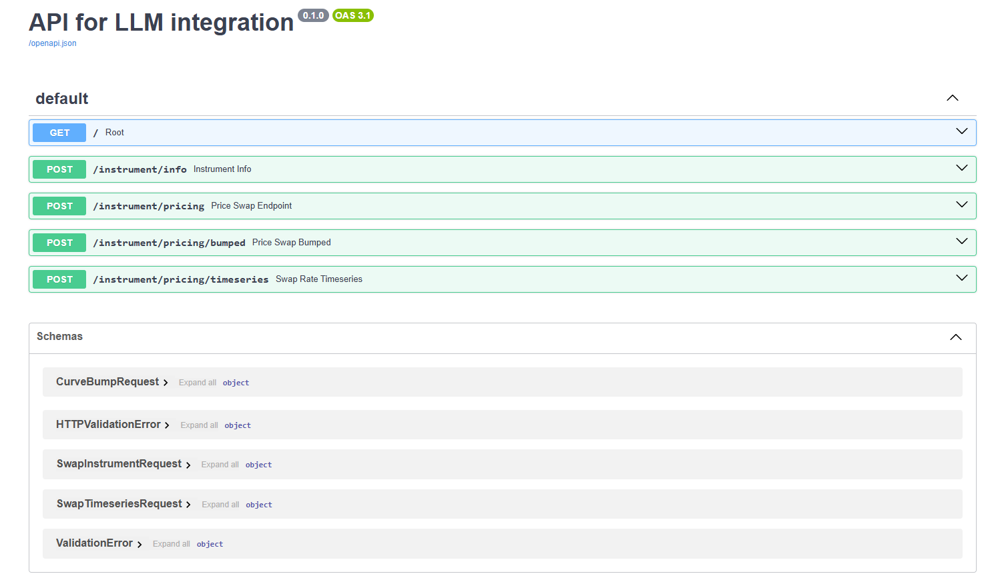
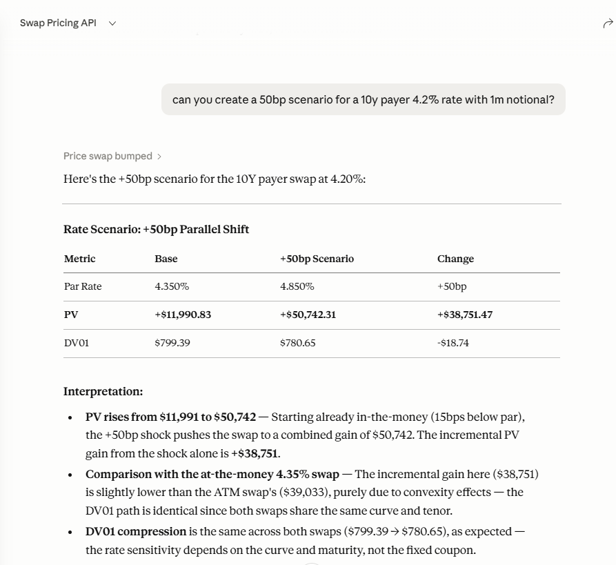

# IRS Pricing API

A FastAPI-based REST API for pricing vanilla **Interest Rate Swaps (IRS)** using a bootstrapped discount curve. Built as a lightweight, LLM-friendly analytics backend.

---
### Swagger UI and Claude with MCP server 

The Swagger UI showing all available endpoints:



Claude Desktop calling the `price_swap_bumped` tool and returning a formatted scenario analysis:



---
## Overview

This API bootstraps a discount curve from market instruments (deposits, FRAs, and swap rates) and exposes endpoints for pricing, scenario analysis, and historical timeseries generation of vanilla fixed-vs-float interest rate swaps.

It is designed with **LLM integration in mind** — every response includes structured `explain` blocks with pre-computed summaries and model metadata, reducing the need for downstream interpretation.

## Features

- **Curve bootstrapping** from deposits (short end), FRAs (belly), and par swap rates (long end)
- **Log-linear interpolation** between bootstrapped pillars
- **Vanilla IRS pricing**: PV, par rate, and DV01
- **Scenario / bump-and-reprice**: parallel curve shifts in basis points
- **Historical timeseries**: simulated historical rates with drift and noise
- **Swagger UI** at `/docs` for interactive testing
- **Structured explain blocks** on every response for LLM consumption

---

## Project Structure

```
src/my_package/
├── main.py          # FastAPI app and endpoint definitions
├── an_lib.py        # Analytics: curve bootstrapping and swap pricing
├── models.py        # Pydantic request/response models
├── __init__.py
├── request_5y_payer.json
├── request_par_rate_timeseries.json
├── request_scenario_perturbation.json
└── request_trade_info.json
```

---

## Getting Started

### Prerequisites

- Python 3.9+
- pip

### Installation

```powershell
# 1. Create virtual environment
python -m venv .venv

# 2. Activate it (PowerShell)
.venv\Scripts\activate

# 3. Install dependencies
pip install -r requirements.txt

# 4. Launch the server
uvicorn src.my_package.main:app --reload
```

The API will be available at `http://127.0.0.1:8000`.  
Navigate to `http://127.0.0.1:8000/docs` for the interactive Swagger UI.

> **Note:** Timeseries responses longer than ~20 days may not render fully in the Swagger UI. Use `curl` for longer date ranges.

---

## Curve Construction

The discount curve is bootstrapped sequentially:

| Instrument | Tenors | Convention |
|---|---|---|
| Deposits | 1M, 3M, 6M | ACT/360 |
| FRAs | 6M×9M → 21M×24M | ACT/360 |
| Par Swaps | 3Y → 60Y | ACT/360, semi-annual fixed |

Interpolation uses **log-linear** interpolation on discount factors between pillar dates.

---

## Assumptions & Limitations

- Single-curve framework (no OIS/LIBOR basis)
- ACT/360 day count for all instruments
- Static, hardcoded market data (not live rates)
- No CVA, FVA, or credit adjustments
- Notional is not exchanged
- Historical timeseries uses synthetic data (2 bps/day drift + random noise), not real historical rates
- DV01 is an analytical approximation, not full bump-and-reprice

---

## API Endpoints

### `GET /`
Health check — confirms the API is running.

---

### `POST /instrument/info`
Returns descriptive metadata about a swap instrument without pricing it.

**Example request:**
```json
{
  "maturity": 10,
  "fixedRate": 0.047,
  "notional": 1000000,
  "payOrReceive": "receive"
}
```

---

### `POST /instrument/pricing`
Prices a vanilla IRS on the base bootstrapped curve. Returns PV, par rate, DV01, and an LLM-ready explanation.

**Example request:**
```bash
curl -X POST http://127.0.0.1:8000/instrument/pricing \
  -H "Content-Type: application/json" \
  -d @src/my_package/request_5y_payer.json
```

**Example response:**
```json
{
  "instrument": { "maturity": 5.0, "fixedRate": 0.045, ... },
  "curve": "base",
  "results": {
    "pv": 372.70,
    "par_rate": 0.04508,
    "dv01": 440.60
  },
  "measure_definitions": { ... },
  "explain": { "model": "discounted_cashflow_swap", ... }
}
```

---

### `POST /instrument/pricing/bumped`
Reprices the swap under a parallel curve shift (in basis points). Useful for DV01 validation or scenario analysis.

**Example request:**
```bash
curl -X POST http://127.0.0.1:8000/instrument/pricing/bumped \
  -H "Content-Type: application/json" \
  -d @src/my_package/request_scenario_perturbation.json
```

---

### `POST /instrument/pricing/timeseries`
Generates a daily timeseries of par rates and PV between two dates, using simulated historical market data with upward drift and noise.

**Example request:**
```bash
curl -X POST http://127.0.0.1:8000/instrument/pricing/timeseries \
  -H "Content-Type: application/json" \
  -d @src/my_package/request_par_rate_timeseries.json
```
---
## MCP Integration (Model Context Protocol)

This project includes an **MCP server** (`mcp_server.py`) that wraps the FastAPI endpoints as callable tools, allowing any MCP-compatible LLM client (such as Claude Desktop) to price and analyse swaps directly in conversation — no manual API calls needed.

### What is MCP?

MCP (Model Context Protocol) is an open standard that lets LLMs connect to external tools and data sources. The MCP server in this project acts as a bridge: it translates natural-language requests into structured API calls to the FastAPI backend and returns the results back to the model.

### Available MCP Tools

| Tool | Description |
|---|---|
| `get_swap_info` | Returns descriptive metadata about a swap without pricing it |
| `price_swap` | Prices the swap on the base curve — returns PV, par rate, DV01 |
| `price_swap_bumped` | Reprices under a parallel curve shift (scenario / DV01) |
| `get_swap_timeseries` | Daily par rate and PV series between two dates |

### Setting Up MCP with Claude Desktop

**1. Install dependencies**
```powershell
.venv\Scripts\activate
pip install mcp httpx
```

**2. Find your Python path**
```powershell
where python
# e.g. C:\Users\Anna\myproject\.venv\Scripts\python.exe
```

**3. Configure Claude Desktop**

Open `%APPDATA%\Claude\claude_desktop_config.json` and add:
```json
{
  "mcpServers": {
    "irs-pricing": {
      "command": "C:\\Users\\Anna\\myproject\\.venv\\Scripts\\python.exe",
      "args": ["C:\\Users\\Anna\\myproject\\mcp_server.py"]
    }
  }
}
```
> Use double backslashes `\\` in all Windows paths.

**4. Start the FastAPI server first**
```powershell
uvicorn src.my_package.main:app --reload
```

**5. Restart Claude Desktop**

If the MCP server loaded correctly, a 🔨 hammer icon will appear in the chat input bar.

**6. Chat naturally**

Examples:
- *"Price a 5 year payer swap at 4.5% fixed rate on 1 million notional"*
- *"What's the DV01 of a 10Y receiver at 4.35%?"*
- *"Run a +50bp scenario on a 10Y payer at 4.2%"*
- *"Show the par rate timeseries for January 2026 on a 5Y payer"*

---

## Dependencies

```
fastapi[standard]
uvicorn[standard]
pydantic>=2.0
numpy
requests
scipy
mcp
httpx
```

---

## Author

Anna Papakonstantopoulou — [ann.papakonstantopoulou@gmail.com](mailto:ann.papakonstantopoulou@gmail.com)
